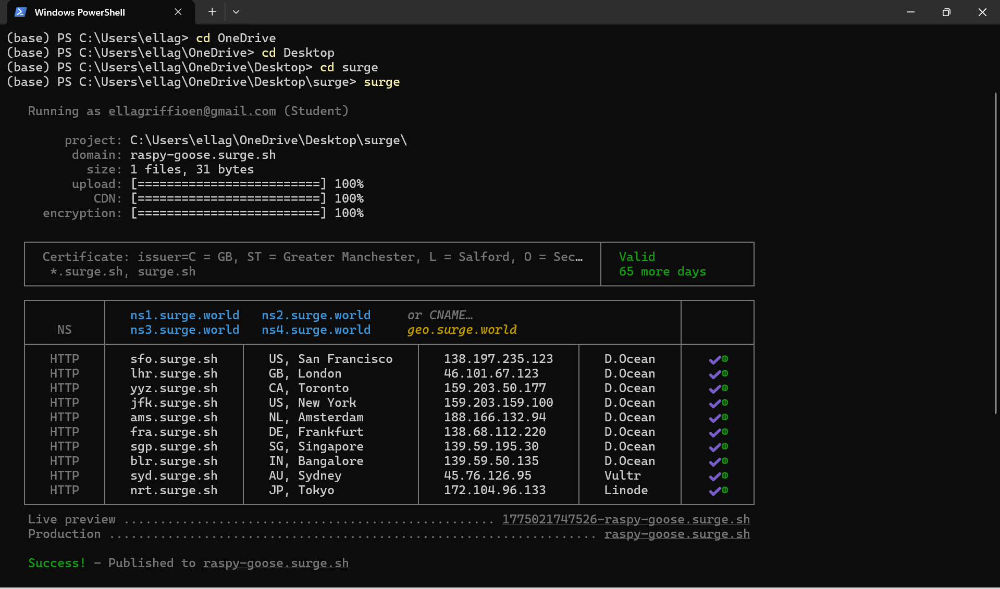
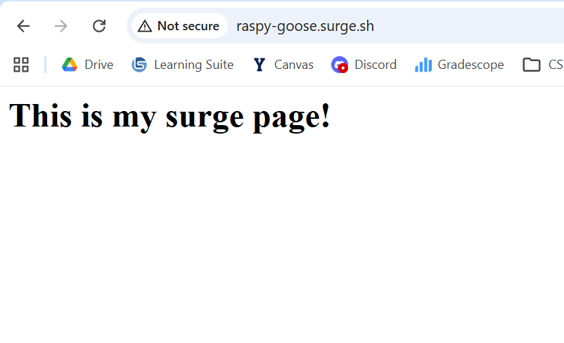
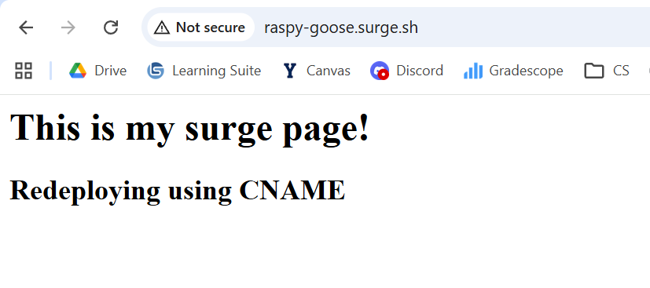
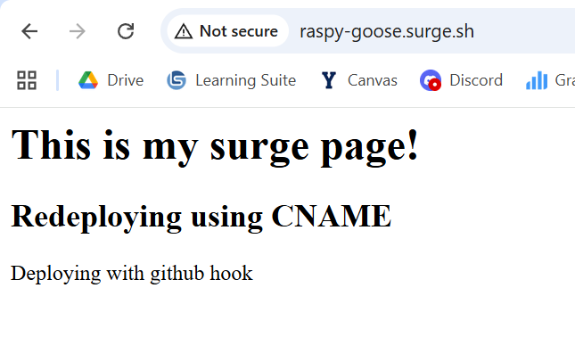

**Introduction:**  
I chose to look into different ways to host dynamic and static websites because I have only had experience with AWS. I was surprised to hear that I could host a static website on github like we did in this class because I always assumed that github was just for code repos. I got curious about what other options could be used to host websites and what costs and benefits are of using other systems. In this process I found Surge, which allows you to deploy a static website from the command line.

**Surge:**

**Url:** [https://surge.sh/](https://surge.sh/)

Surge allows for the deployment of front-end static web apps from the command line. It has no support for back-end functionality, but the simplicity of front end deployment is incredibly convenient. Surge makes it easy for developers to deploy projects to a production-quality CDN through Grunt, Gulp, npm. Npm is a package manager used to install and manage libraries and run scripts. Grunt is a task runner that automates repetitive tasks like minifying files, compiling Sass, and running tests through a config file. Gulp is also a task runner, but uses javascript functions instead of config files to automate tasks. Though I have not used those tools yet, they seem helpful in automating the deployment of websites. Ultimately it is a super fast way to get a static site deployed.

**Installing Surge:**  
To install surge, run:  
`npm install --global surge`

**Manually deploying via the command line:**  
```
//in your project directory run…  
surge  
//prompts for email and password to login/create account  
//checks that you are deploying the right directory  
//prompts for domain name  
//Success! Hopefully…  
```


  


**Manual Redeployment:**  
//To redeploy to the same domain:  
`surge --domain domain-name.surge.sh`

**Manual Redeployment using a CNAME file:**  
``` 
/*NOTE: this command doesn’t work as is in powershell because echo uses UTF-16 there //instead of UTF-8, which it expects. I just manually created a CNAME file in vscode.*/
//To create a CNAME file to deploy to the same domain everytime:  
echo domain-name.surge.sh > CNAME
```  
  
**Deployment through Github hooks:**

1. Create a github repo  
2. Connect repo to development environment  
3. Run `npm init`  
4. Run `npm install --save-dev surge git-scripts`  
5. Double check the package.json now includes something like  
   ```
   "devDependencies": {  
      "surge": "latest",  
      "git-scripts": "0.2.1"  
   }
   ```
6. Add this code right after “devDependencies in package.json:  
   ```
   "git": {  
      "scripts": {  
        "pre-push": "surge --project ./ --domain example-githooks.surge.sh"  
      }  
   }
   ```
7. Push to your repository

**Git Hooks:**
Allows you deploy of a git push without even directly providing surge access to your repository. The pre-push Git Hook runs the surge command and publishes the current directory to the domain (in this example the domain is example-githooks.surge.sh). You can change the command to publish to a different directory by changing the path to project.

  
**My github repository:**  
[https://github.com/egriffioen/surge-example](https://github.com/egriffioen/surge-example)

**My example website:**  
[raspy-goose.surge.sh](raspy-goose.surge.sh)

**Errors I ran into**:   
The main html file must be named index.html. I also ran into bugs using it on gitbash, saying that I didn’t have permission to publish the file. It was fixed when I tried it on powershell. Powershell just has an issue using echo to create the CNAME file.

**Using a Custom Domain:**  
Though I didn’t have a custom domain name ready to try, you can create a new CNAME record on your domain with your DNS provider. You just have to set the hostnames @ and www to:  
[na-west1.surge.sh](http://na-west1.surge.sh).

**Connection to class:**  
Surge provides a super easy and automated way to deploy static websites. As developers, it is important to balance the ease of use of a technology with the capabilities we actually need. I’m a student who wants easy practice with quickly making and deploying websites, which makes surge perfect for me. I am not expecting a lot of traffic on my site and more than anything I want to be able to deploy and see my website with as little work as possible on my end. AWS is much more robust for larger and dynamic projects, but requires more time to set everything up and often costs money. Surge is limited, but is also free and so easy to use, making it possible for anyone to host their website. It also provides a way to connect it to github so that you don’t even have to use the command line. The deployment becomes completely automated.

Other website hosting options: [https://dev.to/anticoder03/10-free-web-hosting-solutions-for-static-and-dynamic-sites-48g1](https://dev.to/anticoder03/10-free-web-hosting-solutions-for-static-and-dynamic-sites-48g1)  