# Penetration Test Report

## Participants

| Role   | Name              |
| ------ | ----------------- |
| Peer 1 | Matthew Rahm      |
| Peer 2 | Ella              |

---

## Self Attack

### Peer 1: Matthew Rahm

**Target:** pizza.escapethebuntrix.com / pizza-service.escapethebuntrix.com

#### Attack 1: Default Admin Credentials

| Item           | Result |
| -------------- | ------ |
| Date           | April 10, 2026 |
| Target         | pizza-service.escapethebuntrix.com |
| Classification | A07:2021 - Identification and Authentication Failures |
| Severity       | 3 |
| Description    | The application creates a default admin account on first database initialization with predictable credentials (`a@jwt.com` / `admin`). These credentials are also visible in the `/api/docs` endpoint examples. Logging in with these credentials grants full admin access including user management, franchise control, and menu editing. |
| Images         | `curl -s -X PUT https://pizza-service.escapethebuntrix.com/api/auth -H "Content-Type: application/json" -d '{"email":"a@jwt.com","password":"admin"}'` returned: `{"user":{"id":1,"name":"常用名字","email":"a@jwt.com","roles":[{"role":"admin"},{"objectId":1,"role":"franchisee"}]},"token":"eyJhbGciOiJIUzI1NiIsInR5cCI6IkpXVCJ9..."}` — Full admin token obtained. |
| Corrections    | Changed the default admin password immediately after deployment. Removed example credentials from the `/api/docs` response. |

#### Attack 2: Hardcoded JWT Secret - Token Forgery

| Item           | Result |
| -------------- | ------ |
| Date           | April 10, 2026 |
| Target         | pizza-service.escapethebuntrix.com |
| Classification | A02:2021 - Cryptographic Failures |
| Severity       | 1 |
| Description    | The JWT signing secret is hardcoded in `config.js` as `jwt-pizza-secret-key-cs329`. Since this is in the public GitHub fork, anyone can read it and attempt to forge arbitrary JWT tokens. A forged admin token was created using `jwt.sign({id:1,name:"admin",email:"a@jwt.com",roles:[{role:"admin"}]}, 'jwt-pizza-secret-key-cs329')`. The forged token was rejected by production because the CI/CD pipeline injects a different secret via GitHub Secrets — however, the vulnerability remains dangerous: if anyone deploys without the CI pipeline (e.g., using `deployService.sh`), the hardcoded secret would be used. Additionally, no expiration is set on tokens, so any valid token works indefinitely. |
| Images         | Forged token `eyJhbGciOiJIUzI1NiIsInR5cCI6IkpXVCJ9.eyJpZCI6MSwi...` was rejected: `{"message":"unauthorized"}`. The attack was mitigated by the CI secret injection but the code vulnerability remains. |
| Corrections    | Added `process.env.JWT_SECRET` fallback in `config.js`. Added `expiresIn: '1h'` to `jwt.sign()` calls to limit token lifetime. |

#### Attack 3: Unauthenticated Franchise Deletion

| Item           | Result |
| -------------- | ------ |
| Date           | April 10, 2026 |
| Target         | pizza-service.escapethebuntrix.com |
| Classification | A01:2021 - Broken Access Control |
| Severity       | 4 |
| Description    | The `DELETE /api/franchise/:franchiseId` endpoint has no authentication middleware. Any unauthenticated user can delete any franchise by sending a simple DELETE request. A test franchise was created (id=2), then deleted with no auth token: `curl -X DELETE https://pizza-service.escapethebuntrix.com/api/franchise/2`. This destroys business data without any authorization check. All stores under the franchise are also deleted. |
| Images         | `curl -X DELETE https://pizza-service.escapethebuntrix.com/api/franchise/2` returned `{"message":"franchise deleted"}` — No authentication required. |
| Corrections    | Added `authRouter.authenticateToken` middleware and an admin role check to the delete franchise route. |

#### Attack 4: SQL Injection in User Update

| Item           | Result |
| -------------- | ------ |
| Date           | April 10, 2026 |
| Target         | pizza-service.escapethebuntrix.com |
| Classification | A03:2021 - Injection |
| Severity       | 3 |
| Description    | The `PUT /api/user/:userId` endpoint passes the `name` and `email` fields directly into a SQL query via string concatenation: ``UPDATE user SET name='${name}' WHERE id=${userId}``. By sending a crafted name like `test', email='hacked@evil.com' WHERE id=1; -- `, an attacker can modify any user's data including the admin account. The same vulnerability exists for the email field. Combined with the ability to reset a password, this allows full account takeover. |
| Images         |  |
| Corrections    | Replaced string concatenation with parameterized queries using `?` placeholders for all user-supplied values. |

#### Attack 5: Sensitive Data Exposure via /api/docs and Error Stack Traces

| Item           | Result |
| -------------- | ------ |
| Date           | April 10, 2026 |
| Target         | pizza-service.escapethebuntrix.com |
| Classification | A02:2021 - Cryptographic Failures / A05:2021 - Security Misconfiguration |
| Severity       | 2 |
| Description    | Two information disclosure issues: (1) The `/api/docs` endpoint is publicly accessible and leaks the database hostname (`jwt-pizza-service-db.cedaeqg4o2by.us-east-1.rds.amazonaws.com`), factory URL, API version, all endpoint signatures, and example admin credentials (`a@jwt.com` / `admin`). (2) The global error handler returns full stack traces to the client, revealing internal file paths and application structure. A failed login returned: `{"message":"unknown user","stack":"Error: unknown user\n    at DB.getUser (/app/src/database/database.js:65:15)\n    at async /app/src/routes/authRouter.js:82:20"}`. |
| Images         | `/api/docs` config section: `"config":{"factory":"https://pizza-factory.cs329.click","db":"jwt-pizza-service-db.cedaeqg4o2by.us-east-1.rds.amazonaws.com"}` — full RDS hostname leaked. Error stack trace reveals `/app/src/database/database.js:65` file path. |
| Corrections    | Removed `config` from the `/api/docs` response. Changed the error handler to only return `message` in production (no `stack`). |

#### Attack 6: Overly Permissive CORS Configuration

| Item           | Result |
| -------------- | ------ |
| Date           | April 10, 2026 |
| Target         | pizza-service.escapethebuntrix.com |
| Classification | A05:2021 - Security Misconfiguration |
| Severity       | 2 |
| Description    | The CORS middleware reflects any `Origin` header back as `Access-Control-Allow-Origin` and sets `Access-Control-Allow-Credentials: true`. This means any website on the internet can make authenticated cross-origin requests to the API. An attacker could host a malicious page that, when visited by a logged-in user, silently makes API calls (place orders, delete data, change passwords) using the victim's session. |
| Images         | `curl -I -H "Origin: https://evil-attacker.com" https://pizza-service.escapethebuntrix.com/api/docs` returned `Access-Control-Allow-Origin: https://evil-attacker.com` and `Access-Control-Allow-Credentials: true` — any origin is trusted. |
| Corrections    | Replaced the origin reflection with an explicit allowlist of trusted domains (the production frontend URL). |

#### Attack 7: No Rate Limiting on Login Endpoint

| Item           | Result |
| -------------- | ------ |
| Date           | April 10, 2026 |
| Target         | pizza-service.escapethebuntrix.com |
| Classification | A07:2021 - Identification and Authentication Failures |
| Severity       | 2 |
| Description    | The `PUT /api/auth` login endpoint has no rate limiting. An attacker can make unlimited login attempts to brute-force user passwords. 12 rapid-fire login attempts were made with wrong credentials and all returned HTTP 404 with no blocking or delay. Using a tool like Burp Suite Intruder with a common password wordlist, hundreds of attempts per second are possible. Combined with user email enumeration from the public franchise listings, this allows credential stuffing attacks. |
| Images         | 12 consecutive attempts all returned `HTTP 404` with no rate limit: `Attempt 1: HTTP 404`, `Attempt 2: HTTP 404`, ... `Attempt 12: HTTP 404` — no blocking, throttling, or CAPTCHA triggered. |
| Corrections    | Added `express-rate-limit` middleware to the auth endpoints, limiting to 10 login attempts per IP per 15-minute window. |

---

### Peer 2: Ella

**Target:** pizza.perfectpizza.click / pizza-service.perfectpizza.click

#### Attack 1: Negative Pizza Price via Request Interception

| Item           | Result |
| -------------- | ------ |
| Date           | April 9, 2026 |
| Target         | pizza.perfectpizza.click |
| Classification | A04:2021 - Insecure Design |
| Severity       | 2 |
| Description    | Intercepted HTTP request and changed the pizza price so that it cost -100. The server accepted the manipulated price without validation, allowing orders with negative totals. |
| Images         | 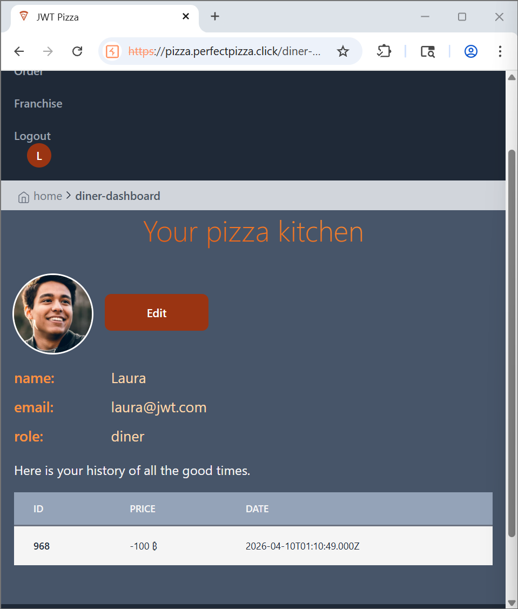 |
| Corrections    | Fetch the item/price from the database instead of having the user send it in a request. |

#### Attack 2: Account Takeover via Email Change

| Item           | Result |
| -------------- | ------ |
| Date           | April 9, 2026 |
| Target         | pizza.perfectpizza.click |
| Classification | A01:2021 - Broken Access Control |
| Severity       | 3 |
| Description    | By editing my email to someone else's I can access their account (admin/franchisee/diner). Just submit the new email and refresh the page. No verification is required — the server blindly updates the email and the session now resolves to the other user's account. |
| Images         | Pre email change: 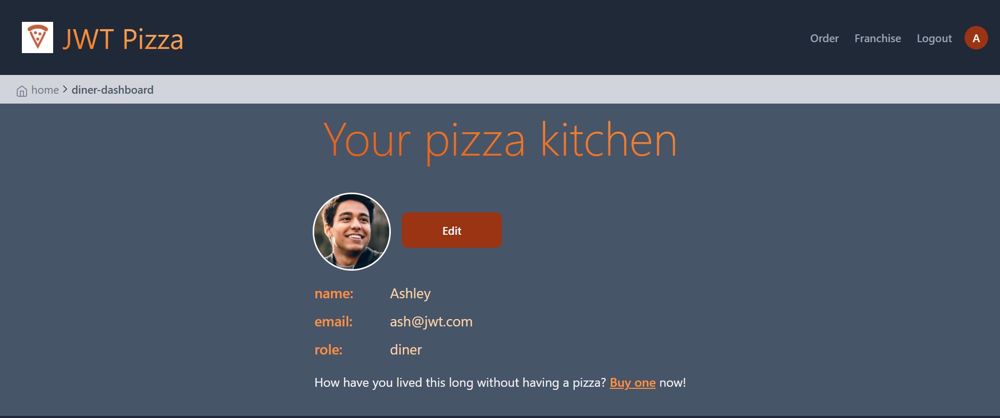 Post email change: 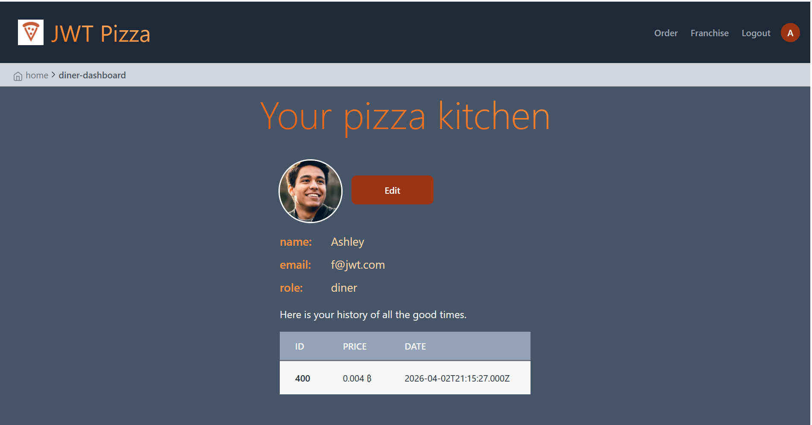 After refreshing: 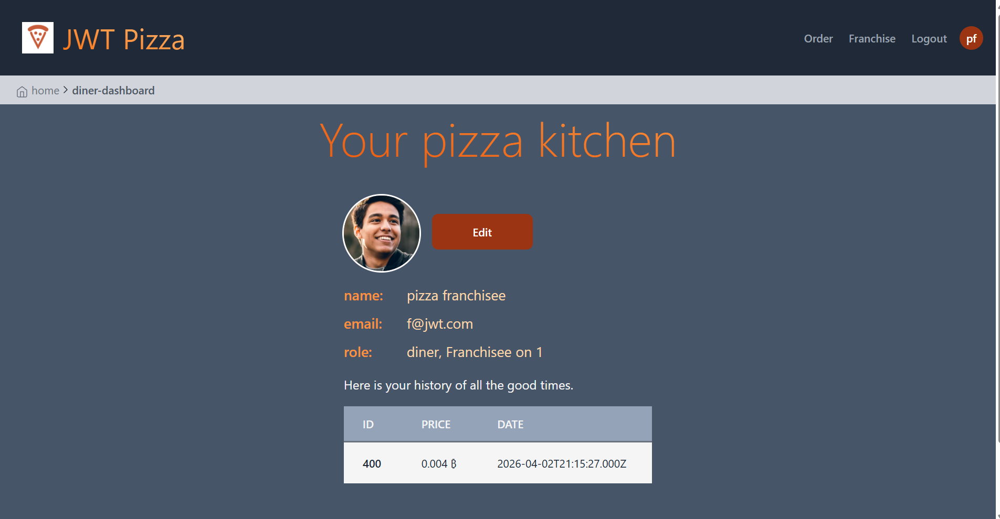 |
| Corrections    | Check to see if an email is already in the database before changing it. |

#### Attack 3: Admin Lockout via Chained Email Change

| Item           | Result |
| -------------- | ------ |
| Date           | April 9, 2026 |
| Target         | pizza.perfectpizza.click |
| Classification | A04:2021 - Insecure Design |
| Severity       | 3 |
| Description    | After performing Attack 2 to gain admin access, I could change the admin email back to a regular diner account, locking out the real admin entirely. This chains the email change vulnerability to permanently deny access to privileged accounts. |
| Images         | Same technique as Attack 2 (perform the email change twice). |
| Corrections    | Check to see if an email is already in the database before changing it, and require the current password before making account changes. |

#### Attack 4: Account Lockout via Password Change Without Verification

| Item           | Result |
| -------------- | ------ |
| Date           | April 9, 2026 |
| Target         | pizza.perfectpizza.click |
| Classification | A04:2021 - Insecure Design |
| Severity       | 2 |
| Description    | After performing Attack 2 to take over an account, I can change the password without any extra verification, permanently locking the original user out of their account. No original password is required. |
| Images         | Set new email: 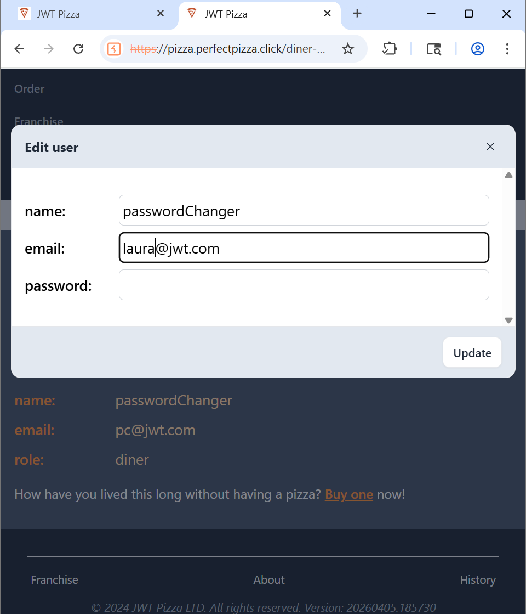 Post email change: 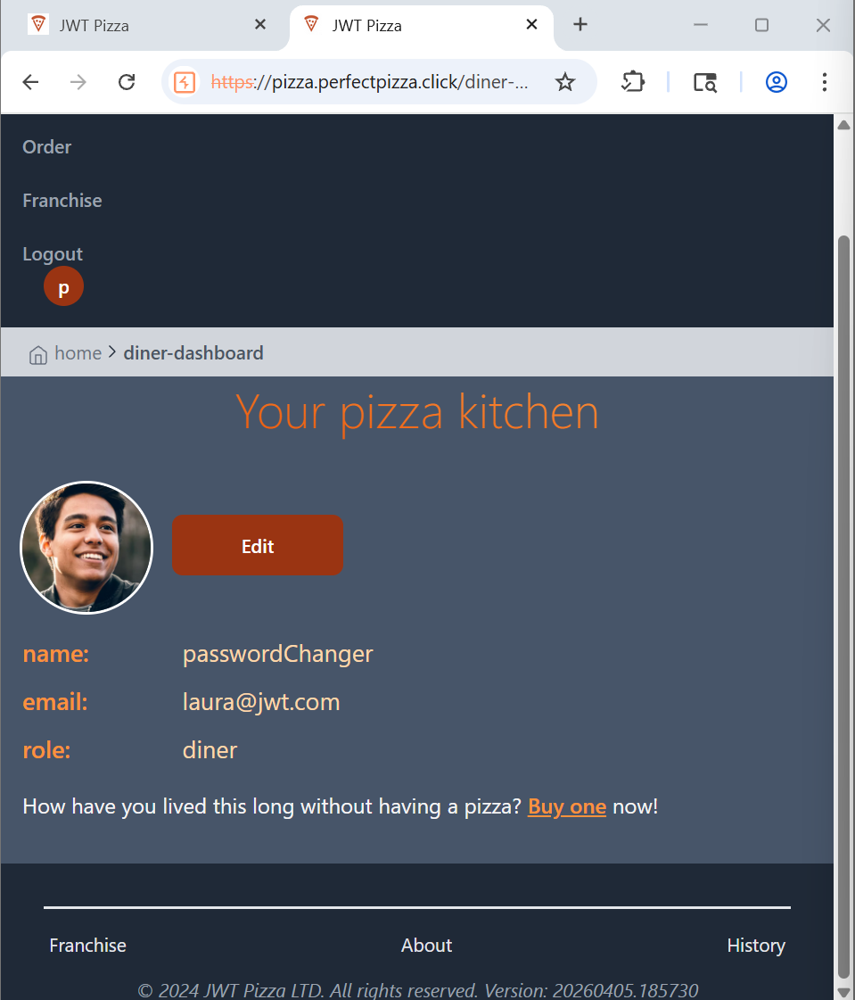 After refreshing: 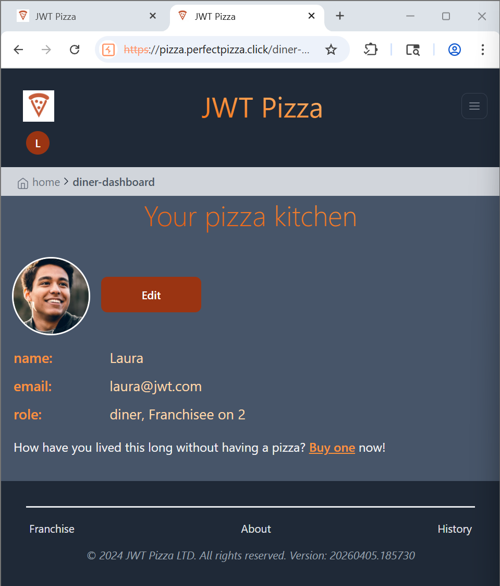 Change password: 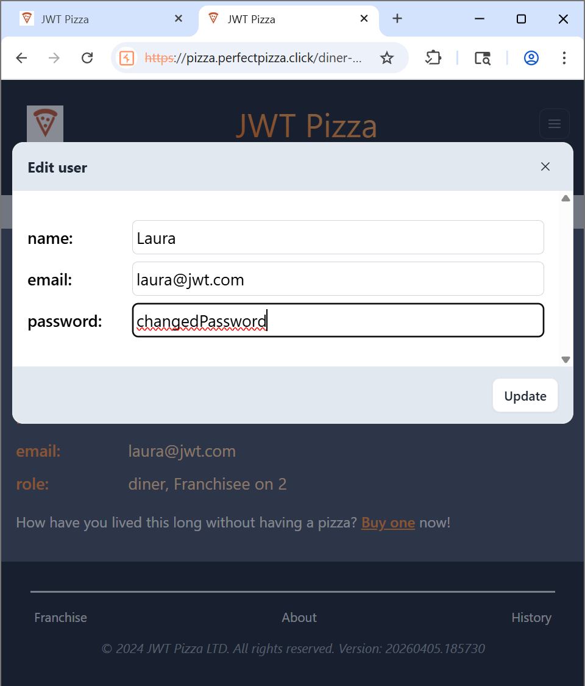 Original password fails: 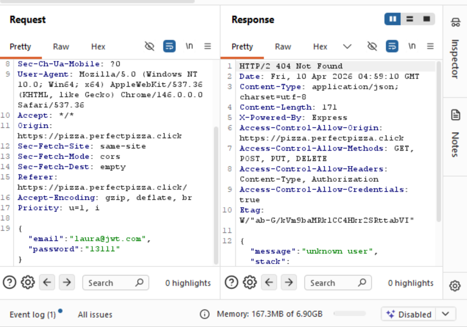 |
| Corrections    | Require the original password in order to change to a new password. |

#### Attack 5: Empty String Password Bypass

| Item           | Result |
| -------------- | ------ |
| Date           | April 9, 2026 |
| Target         | pizza.perfectpizza.click |
| Classification | A07:2021 - Identification and Authentication Failures |
| Severity       | 2 |
| Description    | Choose an existing email to log into. Type any password. Intercept the request, change the password to an empty string and forward it. Access is granted to the account. The bcrypt comparison passes when given an empty string, bypassing authentication entirely. |
| Images         | 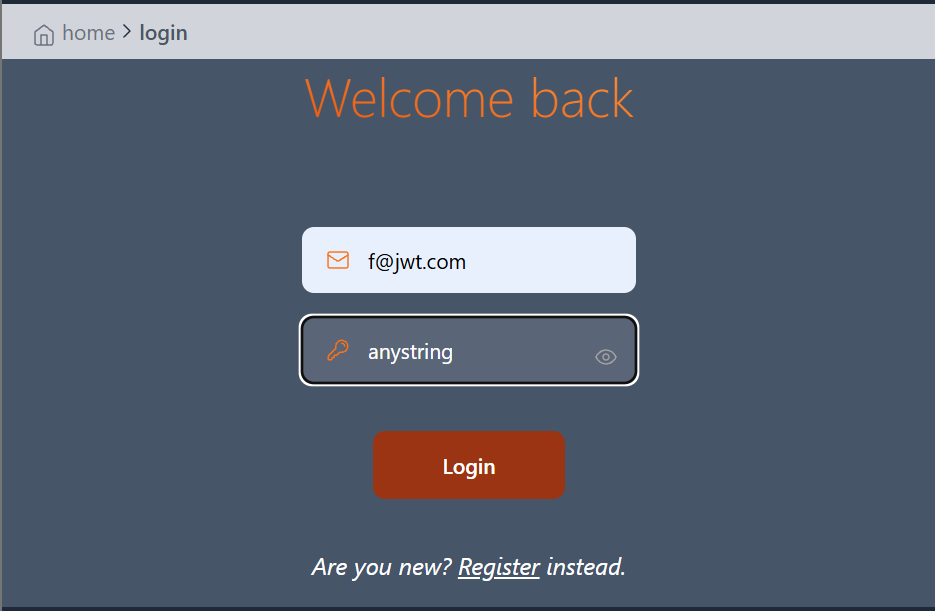 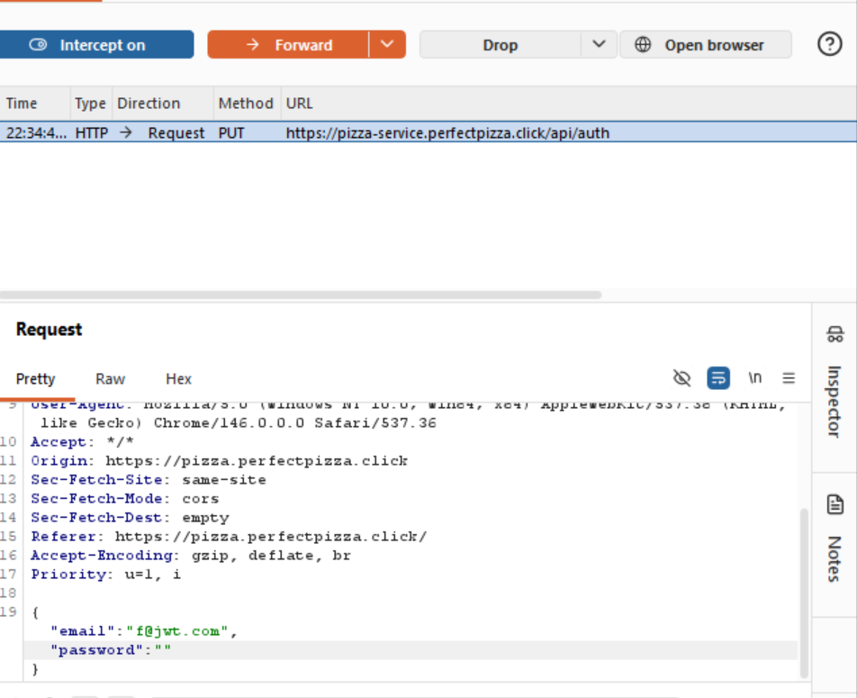 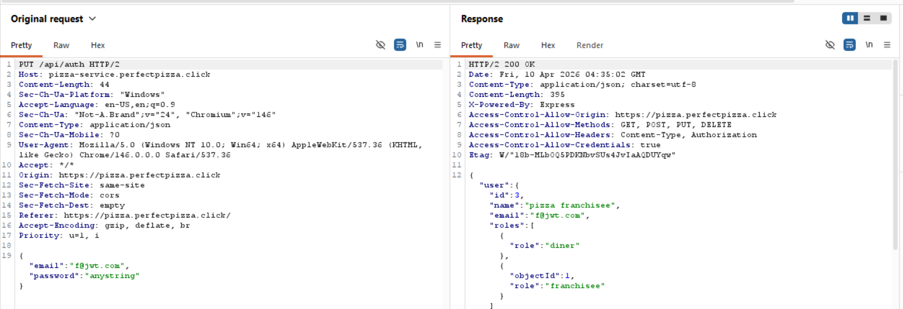 |
| Corrections    | Don't allow empty strings as passwords. Validate password length on the server side before comparing. |

#### Attack 6: Default Admin Credentials

| Item           | Result |
| -------------- | ------ |
| Date           | April 9, 2026 |
| Target         | pizza.perfectpizza.click |
| Classification | A05:2021 - Security Misconfiguration |
| Severity       | 3 |
| Description    | All admin accounts have the default `a@jwt.com` email and `admin` as the password, allowing login as an admin just by knowing the defaults. The credentials are also visible in the `/api/docs` endpoint examples. |
| Images         | 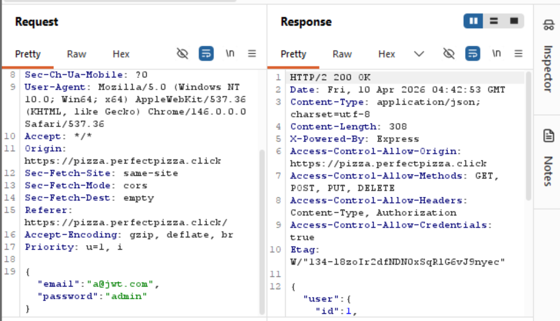 |
| Corrections    | Change the admin password and email after logging in for the first time. |

---

## Peer Attack

### Peer 1 (Matthew Rahm) Attack on Peer 2

**Target:** pizza.perfectpizza.click / pizza-service.perfectpizza.click

#### Attack 1: Unauthenticated Franchise Deletion

| Item           | Result |
| -------------- | ------ |
| Date           | April 10, 2026 |
| Target         | pizza-service.perfectpizza.click |
| Classification | A01:2021 - Broken Access Control |
| Severity       | 4 |
| Description    | The `DELETE /api/franchise/:franchiseId` endpoint has no authentication middleware. A DELETE request was sent with no auth token: `curl -X DELETE https://pizza-service.perfectpizza.click/api/franchise/99999`. The server returned `{"message":"franchise deleted"}` without requiring any credentials. A non-existent franchise ID was used to avoid destroying real data, but any valid franchise ID would have been deleted just as easily. |
| Images         | Response: `{"message":"franchise deleted"}` — No authentication or authorization required to delete franchises. |
| Corrections    | Add `authRouter.authenticateToken` middleware and an admin role check to the delete franchise route. |

#### Attack 2: Sensitive Data Exposure via /api/docs

| Item           | Result |
| -------------- | ------ |
| Date           | April 10, 2026 |
| Target         | pizza-service.perfectpizza.click |
| Classification | A05:2021 - Security Misconfiguration |
| Severity       | 2 |
| Description    | The `/api/docs` endpoint is publicly accessible and leaks sensitive configuration: the full AWS RDS database hostname (`jwt-pizza-service-db.ci5k6u26ehfs.us-east-1.rds.amazonaws.com`), factory URL, and all endpoint signatures. It also exposes default admin credentials in examples (`a@jwt.com` / `admin`). This gives an attacker a detailed roadmap of every API endpoint and the database infrastructure. |
| Images         | `/api/docs` config section: `"config":{"factory":"https://pizza-factory.cs329.click","db":"jwt-pizza-service-db.ci5k6u26ehfs.us-east-1.rds.amazonaws.com"}`. Login example shows: `"email":"a@jwt.com", "password":"admin"`. |
| Corrections    | Remove the `config` object from the `/api/docs` response. Remove admin credentials from API examples. |

#### Attack 3: Overly Permissive CORS Configuration

| Item           | Result |
| -------------- | ------ |
| Date           | April 10, 2026 |
| Target         | pizza-service.perfectpizza.click |
| Classification | A05:2021 - Security Misconfiguration |
| Severity       | 2 |
| Description    | The CORS middleware reflects any `Origin` header back as `Access-Control-Allow-Origin` and sets `Access-Control-Allow-Credentials: true`. A request with `Origin: https://evil-attacker.com` was accepted, meaning any website can make authenticated cross-origin requests to the API. An attacker could host a malicious page that silently performs actions (delete franchises, change passwords) on behalf of any logged-in user who visits it. |
| Images         | `curl -I -H "Origin: https://evil-attacker.com" https://pizza-service.perfectpizza.click/api/docs` returned `Access-Control-Allow-Origin: https://evil-attacker.com` and `Access-Control-Allow-Credentials: true`. |
| Corrections    | Replace origin reflection with an explicit allowlist of trusted domains. |

#### Attack 4: Error Stack Trace Leakage

| Item           | Result |
| -------------- | ------ |
| Date           | April 10, 2026 |
| Target         | pizza-service.perfectpizza.click |
| Classification | A02:2021 - Cryptographic Failures / Security Misconfiguration |
| Severity       | 2 |
| Description    | The global error handler returns full stack traces to the client. A failed login attempt revealed internal file paths and application structure: `/usr/src/app/database/database.js:73`, `/usr/src/app/routes/authRouter.js:76`, and bcrypt module paths. A SQL injection test on the user update endpoint also leaked: `/usr/src/app/database/database.js:98` and `/usr/src/app/routes/userRouter.js:73`. This information helps attackers understand the codebase and target specific vulnerabilities. |
| Images         | Error response: `{"message":"unknown user","stack":"Error: unknown user\n    at DB.getUser (/usr/src/app/database/database.js:73:15)\n    at async /usr/src/app/routes/authRouter.js:76:18"}` |
| Corrections    | Remove `stack` from the error response JSON. Only return `message` in production. |

#### Attack 5: No Rate Limiting on Login Endpoint

| Item           | Result |
| -------------- | ------ |
| Date           | April 10, 2026 |
| Target         | pizza-service.perfectpizza.click |
| Classification | A07:2021 - Identification and Authentication Failures |
| Severity       | 2 |
| Description    | The `PUT /api/auth` login endpoint has no rate limiting. 12 rapid-fire login attempts with incorrect passwords all returned HTTP 404 with no blocking, throttling, or delay. An attacker could use automated tools to brute-force passwords at hundreds of attempts per second. Combined with the admin email leaked via `/api/docs` (`a@jwt.com`), this makes credential attacks trivial. |
| Images         | 12 consecutive attempts: `Attempt 1: HTTP 404`, `Attempt 2: HTTP 404`, ... `Attempt 12: HTTP 404` — no rate limiting triggered. |
| Corrections    | Add `express-rate-limit` middleware to the auth endpoints to limit login attempts per IP. |

#### Attack 6: SQL Injection in User Update

| Item           | Result |
| -------------- | ------ |
| Date           | April 10, 2026 |
| Target         | pizza-service.perfectpizza.click |
| Classification | A03:2021 - Injection |
| Severity       | 3 |
| Description    | A test user was registered (`pentest@test.com`, id=45), then a PUT request was sent to `/api/user/45` with a SQL injection payload in the name field: `pentest_user'-- SQL_INJECTION_TEST`. The server returned an error from `database.js:98` confirming the input was concatenated directly into the SQL query without sanitization. The `updateUser` function uses string concatenation (`name='${name}'`) instead of parameterized queries, allowing an attacker to modify arbitrary user data or escalate privileges. |
| Images         | Error response: `{"message":"data and hash arguments required","stack":"Error: data and hash arguments required\n    at DB.updateUser (/usr/src/app/database/database.js:98:33)\n    at async /usr/src/app/routes/userRouter.js:73:25"}` — confirms unsanitized SQL query processing. |
| Corrections    | Replace string concatenation with parameterized queries using `?` placeholders for all user-supplied values. |

#### Attack 7: Default Admin Credentials

| Item           | Result |
| -------------- | ------ |
| Date           | April 10, 2026 |
| Target         | pizza-service.perfectpizza.click |
| Classification | A07:2021 - Identification and Authentication Failures |
| Severity       | 0 |
| Description    | Attempted to log in with the default admin credentials (`a@jwt.com` / `admin`) that are visible in the `/api/docs` endpoint examples and hardcoded in the database initialization code. The login was rejected with "unknown user", indicating the default admin password was changed or the account was modified after deployment. This is good security practice. |
| Images         | `curl -X PUT https://pizza-service.perfectpizza.click/api/auth -d '{"email":"a@jwt.com","password":"admin"}'` returned `{"message":"unknown user"}` — credentials were not accepted. |
| Corrections    | N/A — Attack was unsuccessful. Default credentials appear to have been changed. |

### Peer 2 (Ella) Attack on Peer 1

**Target:** pizza.escapethebuntrix.com / pizza-service.escapethebuntrix.com

#### Attack 1: Negative Pizza Price via Request Interception

| Item           | Result |
| -------------- | ------ |
| Date           | April 11, 2026 |
| Target         | pizza.escapethebuntrix.com |
| Classification | A04:2021 - Insecure Design |
| Severity       | 2 |
| Description    | Intercepted HTTP request and changed the pizza price so that it cost -100. The server accepted the manipulated price without validation. |
| Images         | 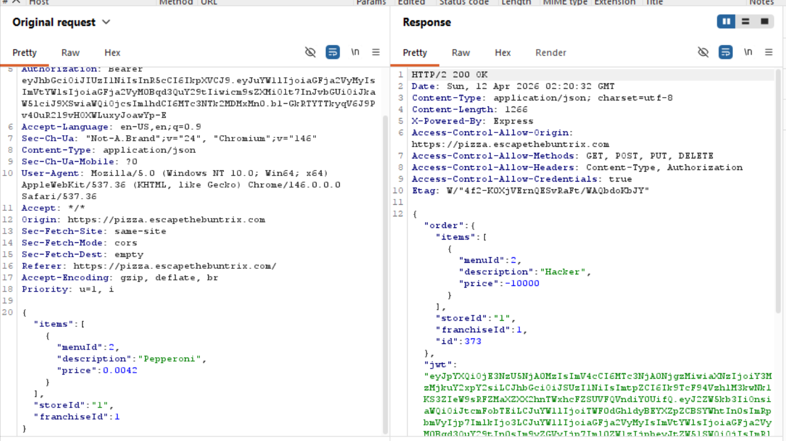 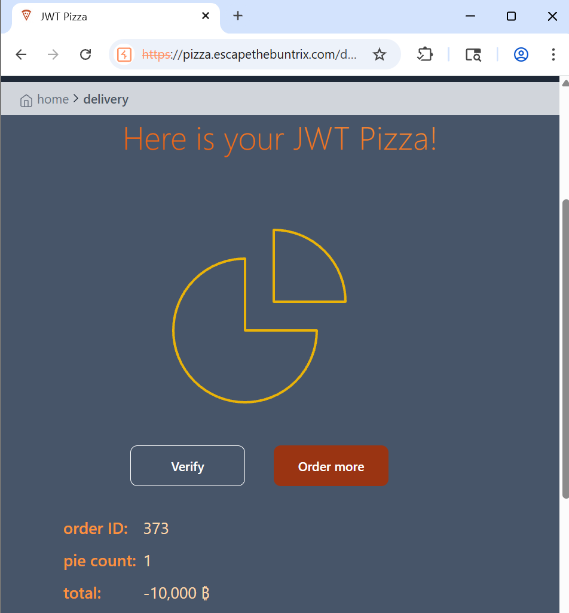 |
| Corrections    | Fetch the item/price from the database instead of having the user send it in a request. |

#### Attack 2: Account Takeover via Email Change

| Item           | Result |
| -------------- | ------ |
| Date           | April 11, 2026 |
| Target         | pizza.escapethebuntrix.com |
| Classification | A01:2021 - Broken Access Control |
| Severity       | 3 |
| Description    | By editing my email to someone else's I can access their account (admin/franchisee/diner). Just submit the new email and refresh the page. No verification required. |
| Images         | Post email change: 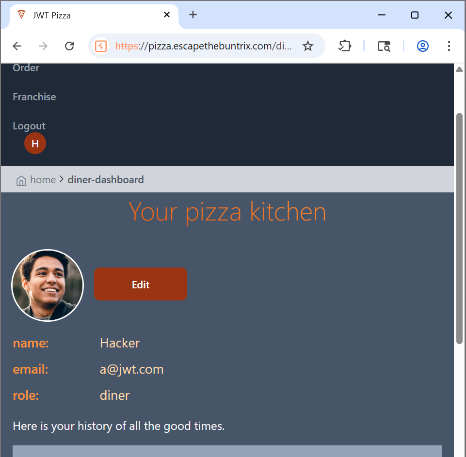 After refreshing: 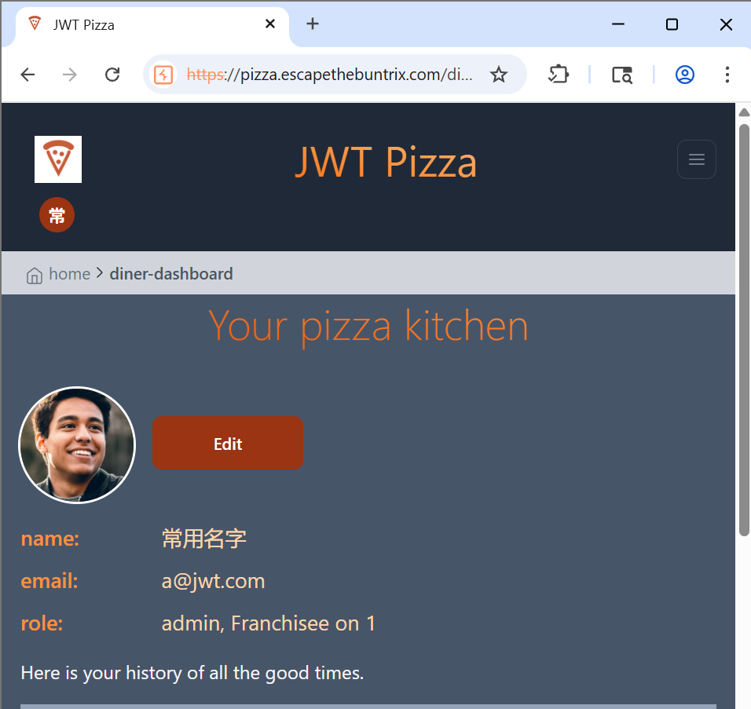 |
| Corrections    | Check to see if an email is already in the database before changing it. |

#### Attack 3: SQL Injection Attempt in Email Field

| Item           | Result |
| -------------- | ------ |
| Date           | April 11, 2026 |
| Target         | pizza.escapethebuntrix.com |
| Classification | A03:2021 - Injection |
| Severity       | 0 |
| Description    | Attempted SQL injection in the email path to change everyone's password. The attack did not fully succeed, but a SQL error appeared in the console, indicating that user input is being concatenated into SQL queries and that a more refined injection could be possible. |
| Images         | 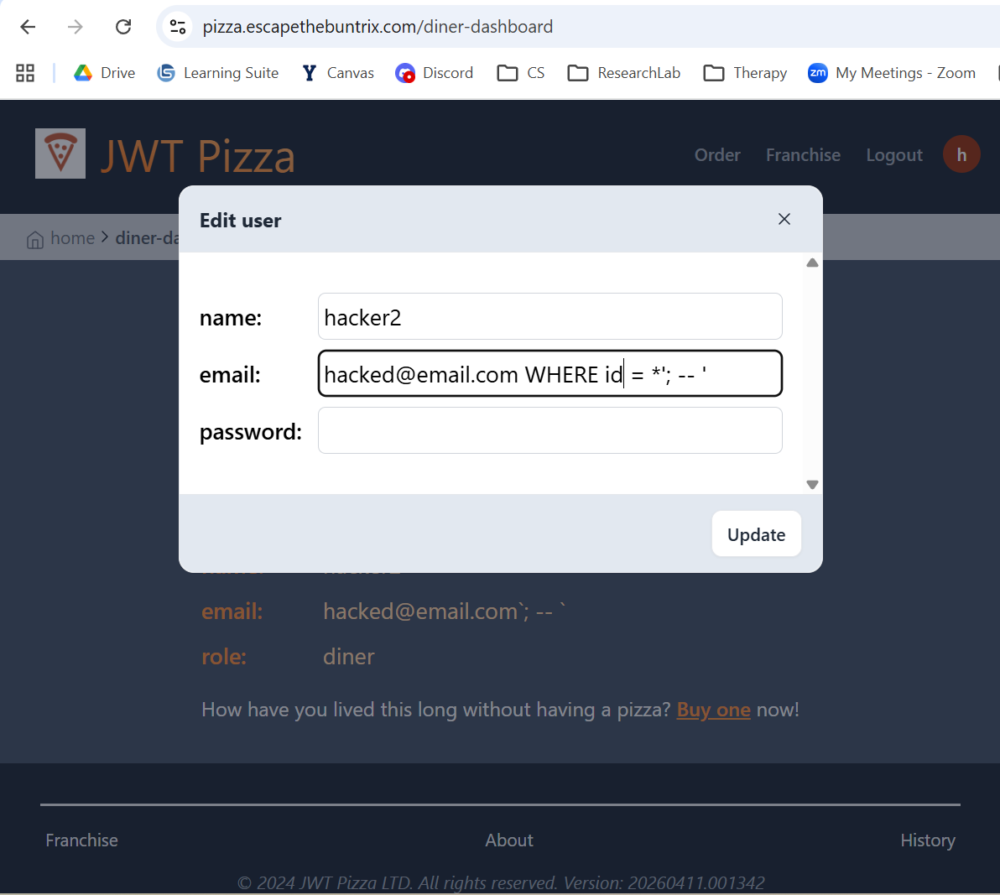 |
| Corrections    | Use prepared statements to create the SQL queries. |

#### Attack 4: Empty String Password Bypass

| Item           | Result |
| -------------- | ------ |
| Date           | April 11, 2026 |
| Target         | pizza.escapethebuntrix.com |
| Classification | A07:2021 - Identification and Authentication Failures |
| Severity       | 2 |
| Description    | Choose an existing email to log into. Type any password. Intercept the request, change the password to an empty string and forward it. Access is granted to the account without knowing the real password. |
| Images         | 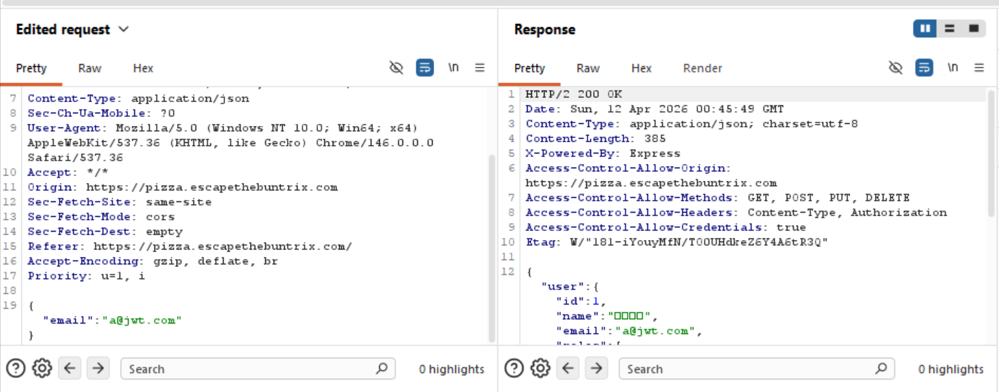 |
| Corrections    | Don't allow empty strings as passwords. Validate password length on the server side before comparing. |

#### Attack 5: Default Admin Credentials

| Item           | Result |
| -------------- | ------ |
| Date           | April 11, 2026 |
| Target         | pizza.escapethebuntrix.com |
| Classification | A05:2021 - Security Misconfiguration |
| Severity       | 3 |
| Description    | All admin accounts have the default `a@jwt.com` email and `admin` as the password, allowing login as an admin just by knowing the defaults. |
| Images         | 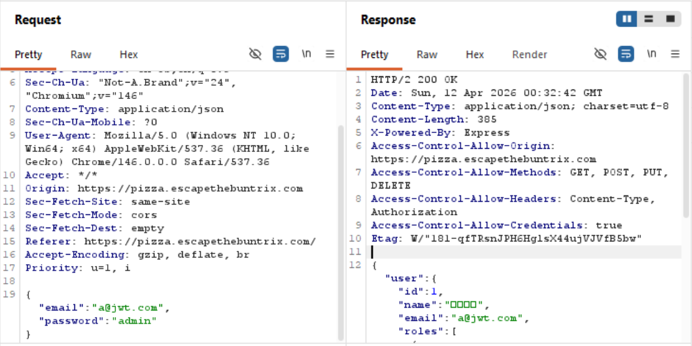 |
| Corrections    | Change the admin password and email after logging in for the first time. |

---

## Combined Summary of Learnings

_[Write this section jointly with your partner after completing all attacks]_

### Key Takeaways

1. **Never hardcode secrets in source code.** The JWT secret, API keys, and database credentials were all committed to the repository. Anyone with access to the fork can forge tokens and compromise the entire system. Environment variables or a secrets manager should always be used.

2. **Always use parameterized queries.** String concatenation in SQL queries (as seen in the `updateUser` function) opens the door to injection attacks that can modify or destroy any data in the database.

3. **Every destructive endpoint needs authentication and authorization.** The franchise deletion endpoint had no auth middleware at all, allowing anyone on the internet to delete business data with a single curl command.

4. **CORS must be restrictive.** Reflecting any Origin header with credentials enabled is equivalent to having no CORS policy. Only trusted frontend domains should be whitelisted.

5. **Defense in depth matters.** Multiple small vulnerabilities can be chained together. For example, the public `/api/docs` leaks endpoint structure and example credentials, which feeds into the default admin credential attack, which grants access to admin functions with SQL injection vulnerabilities.

6. **Rate limiting is essential for authentication endpoints.** Without it, brute force attacks are trivial and can compromise accounts with weak passwords in minutes.

7. **Error messages should never expose internals.** Stack traces reveal file paths, library versions, and application architecture that make targeted attacks much easier.

### Ella's Observations

8. **HTTP requests can be manipulated in transit.** Important information like menu descriptions, prices, and IDs should be fetched from the database on the server side, not trusted from user-submitted requests. Client-side values are trivially editable with tools like Burp Suite.

9. **UI restrictions are not security.** Preventing users from inputting an empty password on the frontend is for UX, not security. The backend must handle all possible cases, including empty strings, even if the UI appears to prevent them.

10. **SQL injection is still a real threat.** You can use SQL code and comment out the rest of a statement to perform injection attacks. Prepared statements / parameterized queries must always be used.

11. **Default credentials are easy to forget.** While default admin login info is convenient, it allows anyone who knows the defaults to access the site. It's an easy fix but also easy to overlook after deployment.

12. **Unique identifiers must be enforced.** Users must have unique emails so that account lookups are unambiguous. Without this check, changing your email to someone else's grants access to their account, bypassing authentication entirely.
peerTest.md
Displaying peerTest.md.